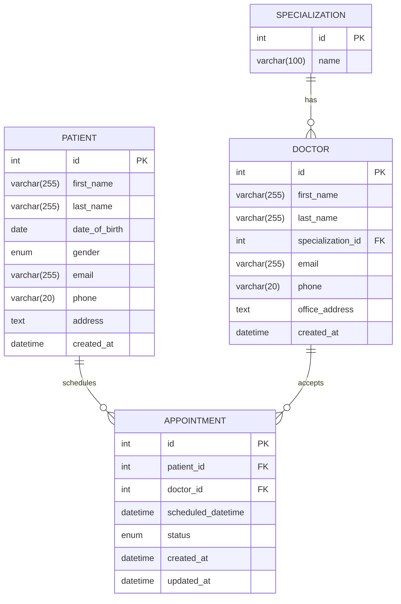

# Heathcare System FastAPI Project

## Overview

- This project is a healthcare appointment scheduling system designed to provide a robust and secure backend service. It allows patients to register and schedule appointments with doctors efficiently.

- The backend is built using:

    - `FastAPI`  Used to build a high-performance RESTful API with automatic documentation and modern Python features.

    - `Redis`  Implemented to handle concurrency and prevent double bookings when multiple patients attempt to book the same doctor simultaneously.

    - `MySQL`  Serves as the primary relational database for storage of patients, doctors, and appointments data.

### API Documentation (Swagger)

- You can view and test the available API endpoints through the automatically generated Swagger UI: (Open Swagger Docs.)[https://healthcare-live-demo-production-bf1a.up.railway.app/docs]

### Live Demo

- Interact with the live platform: (Click here)[https://healthcare-live-demo-production-bf1a.up.railway.app]


## Project Structure:     

      
    healthcare-system/ 
        ├── backend/
        │   ├── app/
        │   │   ├── auth.py                 # Authentication functionalities.
        │   │   ├── core                    # redis files
        │   │   ├── database.py             # DB connection
        │   │   ├── models/                 # Database models
        │   │   ├── populate_db/            # Initialize db with doctor specializations
        │   │   ├── routers/                # API endpoints
        │   │   ├── schemas/                # Pydantic schemas
        │   │   ├── services/               # Appoint sevice management.
        │   │   └── utils/                  # helper funtion
        │   ├── Dockerfile                  # Building the fastAPI image
        │   ├── entrypoint.sh               # Script for the app's stating point
        │   ├── main.py                     # FastAPI app instance
        │   ├── requirements.txt            # Dependencies
        │   └── setup_venv.sh               # Dependencies installer script
        ├── docker-compose.yml              # Building Docker container(FastApi+Mysql+Redis)
        ├── frontend                        # Frontend files.
        └── README.md                       # Project Documentation

### List of Packages Required


- `FastAPI`: high-performance web framework for building APIs with Python

- `Uvicorn`: an ASGI (Asynchronous Server Gateway Interface) web server for Python.

- `SQLAlchemy`: ORM (Object Relational Mapper) and SQL toolkit for Python (Object Relational Mapper)

- `PyMySQL`: pure-Python MySQL client library allowing Python to connect to MySQL databases


## Steps to Run the API Locally

1. Fork the repository: `https://github.com/Baraq23/healthcare-system.git`
2. Install required software:
    - MySQL
    - Redis server
    - Python 3

3. Start MySQL, log in as root, and create the database:

```bash
# Start MySQL service
sudo systemctl start mysql

# Log in as root user
mysql -u root -p
# Press Enter when prompted for password

# In the MySQL terminal, run:
CREATE DATABASE healthcaredb;
# This creates a database where FastAPI will manage tables.
```

4. Start the Redis server:

```bash
redis-server
```
5. Open the `healthcare-system` folder in your terminal.

6. Run the setup script to create a Python virtual environment and install dependencies:

```bash
./setup_venv.sh
```

7. Activate the virtual environment:

```bash
source venv/bin/activate
```

8. Start the FastAPI server:

```bash
uvicorn main:app --reload
# This runs the FastAPI server locally on port 8000
```

9. Open your browser and navigate to: `http://localhost:8000/docs` to interact with the API endpoints using Swagger UI.


## API Documentation

- `Base URL; http://localhost:8000 , this is the port from where the FastAPI runs.`


 *`Patients`*

| Method | Path                       | Description                |
|--------|----------------------------|----------------------------|
| POST   | `/patients/login`          | Login patient              |
| GET    | `/patients/`               | Get all patients           |
| POST   | `/patients/`               | Create patient             |
| GET    | `/patients/{patient_id}`   | Get patient by ID          |
| PUT    | `/patients/{patient_id}`   | Update patient by ID       |

---

 *`Doctors`*

| Method | Path                     | Description                |
|--------|--------------------------|----------------------------|
| POST   | `/doctors/login`         | Login doctor               |
| GET    | `/doctors/`              | Get all doctors            |
| POST   | `/doctors/`              | Create doctor              |
| GET    | `/doctors/{doctor_id}`   | Get doctor by ID           |
| PUT    | `/doctors/{doctor_id}`   | Update doctor by ID        |

---

 *`Specializations`*

| Method | Path                                 | Description                |
|--------|--------------------------------------|----------------------------|
| POST   | `/specializations/`                  | Create specialization      |
| GET    | `/specializations/`                  | Get all specializations    |
| GET    | `/specializations/{specialization_id}`| Get specialization by ID   |

---

 *`Appointments`*

| Method | Path                                               | Description                      |
|--------|----------------------------------------------------|----------------------------------|
| POST   | `/appointments/`                                  | Create appointment               |
| GET    | `/appointments/patient/{patient_id}`               | Get patient appointments         |
| GET    | `/appointments/doctor/{doctor_id}`                 | Get doctor appointments          |
| PUT    | `/appointments/{appointment_id}/cancel`            | Cancel appointment               |
| GET    | `/appointments/doctor/{doctor_id}/available-slots` | Get available slots for doctor   |


## Database Structure

The project utilizes a MySQL database named healthcare. This database comprises four core tables: patients, doctors, appointments, and specialization. These tables store essential data about patients, doctors, doctor-specialization and appointment schedules, respectively, with relationships established via foreign keys to maintain data integrity and support the system's functionality.

***Database Tables***

1. `patient` Table
- This table holds information about registered patients in the system.
```bash
    Columns:
        id: INT, PRIMARY KEY, AUTO_INCREMENT
        A unique identifier for each patient, automatically incremented.
        first_name: VARCHAR(50), NOT NULL
        The patient's first name.
        last_name: VARCHAR(50), NOT NULL
        The patient's last name.
        date_of_birth: DATE, NOT NULL
        The patient's date of birth.
        gender: VARCHAR(10), NOT NULL
        The patient's gender (e.g., "male", "female", "other").
        email: VARCHAR(100), UNIQUE, NOT NULL
        The patient's email address, enforced as unique to prevent duplicate accounts.
        phone: VARCHAR(15), NOT NULL
        The patient's phone number.
        password: VARCHAR(100), NOT NULL
```

- Constraints:
    - Primary Key: `id`
    - Unique Constraint: `email`


2. `doctors` Table
- This table stores details about registered doctors.
```bash
    Columns:
        id: An auto-incrementing integer primary key.
        first_name and last_name: VARCHAR(50), non-null, for the doctor’s name.
        date_of_birth: DATE, non-null, for the doctor’s birth date.
        gender: VARCHAR(10), non-null, to store gender (e.g., "male" or "female").
        specialization_id: INTEGER, non-null, a foreign key linking to specializations(id).
        email: VARCHAR(100), unique and non-null, for the doctor’s email.
        phone: VARCHAR(20), non-null, for the doctor’s phone number.
        address: VARCHAR(200), nullable, for the doctor’s optional address.
        password: VARCHAR(255), non-null, to store the hashed password.
        created_at: DATETIME with a default of the current timestamp.
```
- Constraints:
    - Primary Key: `id`
    - Unique Constraint: `email`
    - Foreign Key: `specialization_id` references `specializations(id)` (enforces the many-to-one relationship).

3. `specializations` Table
- For a more robust design, a separate `specializations` table was introduced to allow multiple specializations per doctor and reduce redundancy and encourage normalization.
```bash
    Columns:
        id: An auto-incrementing integer serving as the primary key.
        name: A unique, non-null VARCHAR(50) to store specialization names (e.g., "Neurology").
```

- Constraints:
    - Primary Key: id
    - Unique Constraint: name (ensures no duplicate specializations).


4. `appointments` Table

- This table manages appointment details, linking patients and doctors.
```bash
Columns:
        id: INT, PRIMARY KEY, AUTO_INCREMENT
        A unique identifier for each appointment.
        patient_id: INT, FOREIGN KEY references patients(id)
        References the patient who booked the appointment.
        doctor_id: INT, FOREIGN KEY references doctors(id)
        References the doctor assigned to the appointment.
        scheduled_datetime: DATETIME, NOT NULL
        The date and time of the appointment, stored in UTC.
        status: ENUM('SCHEDULED', 'COMPLETED', 'CANCELLED'), NOT NULL
        The current status of the appointment.
```
- Constraints:
    - Primary Key: `id`
    - Foreign Key: `patient_id` references `patients(id)`
    - Foreign Key: `doctor_id` references `doctors(id)`

***Relationships***

 *`Entity Relationship Diagram (ERD)`*

- `The following diagram illustrates the relationships between entities in a healthcare appointment scheduling system:`



- The database employs the following relationships to connect the tables:

    *`One-to-Many`* (`Patients` to `Appointments`):
    - A single patient can have multiple appointments, but each appointment is tied to only one patient via the patient_id foreign key.

    *`One-to-Many`* (`Doctors` to `Appointments`):
    - A single doctor can have multiple appointments, but each appointment is linked to only one doctor via the doctor_id foreign key.

    *`Many-to-One`* (`Appointments` to `Patients and Doctors`):
    - Each appointment references one patient and one doctor, establishing many-to-one relationships with both the patients and doctors tables.

    *`Many-to-One`* (`doctor` to `specializations`):
    - The specialization_id foreign key in the doctors table ensures that multiple doctors can reference the same specialization (e.g., "Neurology" or "Gastroenterology"), while each doctor is associated with exactly one specialization.


***Modeling Considerations***

*`Normalization`*:
- The patients and doctors tables store user data independently, and the appointments table links them. The specialization_id in the doctors table is a foreign key linked to a separate specializations table. This structure was introduced to encourage a normalized data structure, allowing each doctor to have one or more specializations if a junction table is used. If only a single specialization is allowed per doctor, specialization_id in the doctors table is sufficient like in this project's case. For multiple specializations, a separate doctor_specializations junction table would be required.

*`Data Integrity`*:
- Foreign keys in the appointments table (patient_id and doctor_id) enforce referential integrity, ensuring appointments are only created for existing patients and doctors. The email unique constraint in both patients and doctors tables prevents duplicate accounts.

*`Time Management`*:
- The scheduled_datetime column uses the DATETIME type with UTC, providing a consistent time standard across the system, which is critical for scheduling accuracy.


## Security

*`User Authentications`*:
- Users (doctors and patients) sign up with their correct personal details and also enters a password with will be used during logging. After successfull login, a JWT access token is issued by the server to the user which they can use to access the protected endpoints. This access tokens expires after some set period of time wich prompt the user to login once more if they need to continue using the platform. This ensures that the user data is protected.

*`API Endpoints Protection`*:
- The protected endpoints can only be accessed by the users with valid JWT tokens which is sent to the server together with requests everytime the user (or brower) sends a request. This access token is verified and the desired response is sent back.
- The endpoints are also protected from other users such that a user cannot access another user's information is not authorised. For example a patient cannot access another patient's information. And therefore only authorised doctorcs will be able to access patient's data or medical records.

*`Database`*:
- MySQL is a very secure database for example it uses password to manage access to the databse therefore user information cannot be accessed by unauthorised parties.


## Future Improvements:
- User validation: such email or phone numbeer verification system will be icorporated and other important details such as ID numbers, emergency contant details, and medical insurance cover details for patients will also be include.
- Incorporate different hospitals to the system so that doctors can attend to patients in different hospitals that offer facilities and equipment in their field of specialization, am making the doctors more accessible by the patient.
- Protect specialization endpoints and all access for the application administrators.


